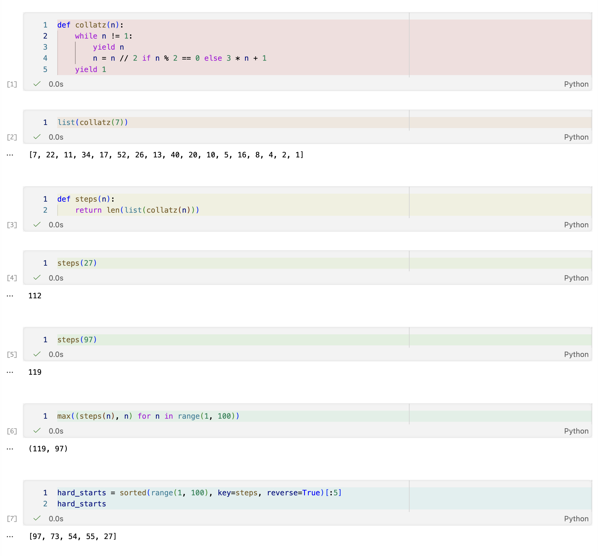

# Jupyter Cell Rainbow

A vscode extension that colors each Jupyter notebook cell based on its position, so it's easier to keep track of where you are while scrolling.



## Install

```
git clone https://github.com/aburkard/jupyter-cell-rainbow.git
cd jupyter-cell-rainbow
npm install
npm run build
npx vsce package
code --install-extension jupyter-cell-rainbow-0.1.0.vsix
```

## Settings

Cmd+, and search "jupyter cell rainbow":

- `enabled` — on/off
- `palette` — rainbow, pastel, ocean, warm, or custom
- `customColors` — hex colors used when palette is custom
- `opacity` — 0 to 1, default 0.12
- `cycleLength` — colors before the palette repeats

## Commands

Cmd+Shift+P:

- Jupyter Cell Rainbow: Toggle
- Jupyter Cell Rainbow: Pick Palette
- Jupyter Cell Rainbow: Refresh Colors

## Limitations

Only the code editor area inside each cell gets colored, not the outer cell frame or the toolbar. That's a vscode api limitation (see [vscode-jupyter#15489](https://github.com/microsoft/vscode-jupyter/issues/15489)). Coloring the whole frame needs css injection via something like apc customize ui++, which patches vscode's install files and wants admin. wasn't worth it.

Rendered markdown cells have no text editor behind them so they don't get colored.

## License

MIT
